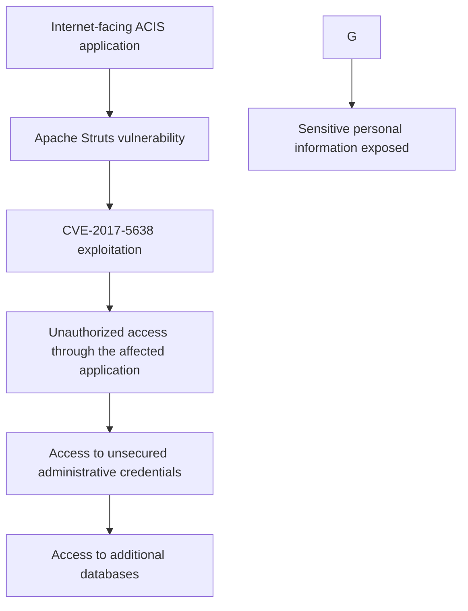

# Equifax 2017 Data Breach – Technical Case Study

## 1. Why I chose this case

The Equifax breach is a useful case for learning because it shows that a major security incident is often a chain of failures rather than one clever exploit.

It connects several fundamentals from Task 1:

- Vulnerability management
- Patch management
- Internet-facing applications
- Credential security
- Network segmentation
- Monitoring
- Confidentiality
- Incident response

## 2. What happened?

Equifax publicly disclosed a major data breach in September 2017.

According to the FTC, the breach affected approximately **147 million people** and exposed sensitive information including names, dates of birth and Social Security numbers. The FTC also reported exposure of payment-card information for approximately 209,000 consumers. [1]

The technical starting point was a vulnerability in Apache Struts used by an Equifax application.

## 3. The vulnerability

The vulnerability was **CVE-2017-5638**.

NIST's National Vulnerability Database describes the flaw as an Apache Struts Jakarta Multipart parser issue that could allow remote attackers to execute arbitrary commands through crafted HTTP headers. NIST rates it **9.8 Critical** under CVSS v3.1. [2]

The vulnerable versions included Struts 2.3.x before 2.3.32 and 2.5.x before 2.5.10.1. [2]

## 4. The patch-management failure

The FTC complaint says US-CERT alerted Equifax in March 2017 about the critical Apache Struts vulnerability and that Equifax's security team instructed responsible staff to patch affected systems within 48 hours. [3]

The problem was not simply “a patch existed”.

The bigger lesson is that a security organization needs a reliable process to answer:

- Did we identify every affected asset?
- Did the right owner receive the ticket?
- Was the patch actually installed?
- Did verification confirm the vulnerability was gone?
- What happens when automated scanning misses an asset?

The FTC later alleged that Equifax's scan failed to detect the vulnerable software on part of its ACIS system. [4]

## 5. Initial access

The vulnerable application was externally reachable.

The attacker exploited the vulnerable Apache Struts component to gain unauthorized access through the affected Internet-facing application.

This aligns closely with MITRE ATT&CK **T1190 – Exploit Public-Facing Application**, which describes exploiting a weakness in an Internet-facing system to obtain initial access. [5]

## 6. What happened after the first compromise?

This is where the case becomes especially valuable.

The FTC reported that attackers were able to access an unsecured file containing administrative credentials stored in plain text. Those credentials allowed access to large amounts of consumer information. [1]

The FTC also alleged failures including:

- insufficient network segmentation,
- failure to protect sensitive information adequately,
- weak credential handling,
- and insufficient intrusion-detection protections for legacy databases. [1]

This is the “blast radius” lesson.

A vulnerable web application is bad.

A vulnerable web application that can reach many sensitive systems is much worse.

## 7. Attack-chain view

## 8. CIA Triad analysis

### Confidentiality — severe compromise

This was the clearest impact.

The breach exposed sensitive personal information on a very large scale. [1]

### Integrity — not the primary documented impact

The sources reviewed for this case emphasize unauthorized access and theft of information. They do not establish broad modification of consumer records as the primary impact.

Therefore, I would document integrity as:

**At risk, but not the main confirmed consequence.**

### Availability — not the primary target

The incident was primarily about unauthorized access and data theft, not deliberate service destruction. Equifax eventually took the affected platform offline as part of its response. [4]

Therefore:

**Availability was affected during response, but it was not the main attacker objective described by the official sources.**

## 9. Root-cause analysis

I would separate the root causes into technical and process failures.

### Technical weaknesses

- Vulnerable Internet-facing software
- Plain-text administrative credentials
- Weak network segmentation
- Insufficient monitoring of legacy systems

### Process weaknesses

- Patch-management execution failure
- Inadequate verification after patching
- Incomplete vulnerability scanning
- Insufficient control over sensitive credentials

## 10. What could have reduced the impact?

The FTC's public material specifically highlights several basic protections: patch software, segment the network and monitor for intruders. [4]

Additional controls suggested by the case include:

1. Reliable asset inventory
2. Risk-based patch management
3. Verification scans after remediation
4. Strong secrets management
5. Least privilege
6. Network segmentation
7. Database access monitoring
8. Centralized security logging
9. Intrusion detection
10. Incident-response exercises

## 11. Detection opportunities

A defender could look for:

- Unexpected requests to a public-facing application
- Repeated application errors around unusual HTTP input
- Web-server processes spawning unexpected shells or utilities
- Access to sensitive databases from application servers
- Administrative credentials being used from unusual hosts
- Large or unusual database reads
- Unusual outbound traffic from servers

MITRE's T1190 detection strategy recommends correlating suspicious requests to public endpoints with abnormal server behavior and possible outbound activity. [6]

## 12. Evidence Discipline and Analyst Reasoning

A useful lesson from this case is that a security analyst should separate
confirmed facts from reasonable inference.

### Confirmed by the public sources reviewed

- The affected system used vulnerable Apache Struts software.
- CVE-2017-5638 was a critical remote-code-execution vulnerability.
- Equifax was alerted to the vulnerability in March 2017.
- The organization instructed responsible staff to patch affected systems.
- The vulnerable ACIS system was not successfully remediated.
- Attackers exploited the vulnerable system.
- Attackers accessed a file containing administrative credentials stored in plain text.
- Those credentials enabled access to large amounts of consumer information.
- The FTC identified inadequate network segmentation and intrusion-detection protections as security failures.

### Reasonable security inference

From a defensive perspective, the compromise demonstrates why an Internet-facing
application should not have unnecessary paths to sensitive databases and why
credentials available to an application should be tightly controlled.

These are security conclusions drawn from the documented architecture and failures,
rather than claims that were independently observed by the analyst.

### What we should not claim without stronger evidence

The sources reviewed do not establish:

- the exact commands executed by the attackers,
- the complete attacker infrastructure,
- a confirmed broad modification of consumer records,
- or a complete ATT&CK technique chain beyond what the available evidence supports.

This distinction matters because professional security analysis should not turn
plausible assumptions into confirmed findings.

## 13. Detection Opportunities

The documented attack path suggests several detection opportunities.

| Stage | Observable | Potential log source | Defensive question |
|---|---|---|---|
| Initial exploitation | Suspicious HTTP requests or unusual request patterns | Web/application/WAF logs | Is someone attempting to exploit the public application? |
| Application failure | Unusual 4xx/5xx spikes or application errors | Application/server logs | Did the suspicious request cause abnormal application behavior? |
| Post-exploitation | Web/application process spawning unexpected commands | EDR/process telemetry | Did the application process execute something it normally should not? |
| Internal access | Application host accessing sensitive databases unexpectedly | Database/network logs | Why is this server reaching this database? |
| Credential abuse | Administrative credentials used from unusual hosts | Authentication logs | Is this credential being used outside its expected context? |
| Data access | Unusual volume or pattern of database reads | Database audit logs | Is the account retrieving more information than normal? |
| Possible exfiltration | Unexpected outbound connections or large transfers | Proxy/firewall/NetFlow logs | Is sensitive data leaving the environment? |

MITRE's T1190 detection strategy similarly recommends correlating suspicious
requests to public-facing applications with errors, abnormal process behavior
and possible outbound connections.

The important lesson is that a useful detection is rarely one isolated log event.
It is often a chain of weak signals that becomes meaningful when correlated.

## 14. What I learned

The biggest lesson is that patching is not a checkbox.

A company can have:

- a vulnerability scanner,
- a patching policy,
- security staff,
- monitoring tools,

and still be compromised if the process does not reliably connect all of those pieces.

The second lesson is blast radius.

When an Internet-facing application is compromised, the security question becomes:

> “What can this application reach now?”

That question leads directly into least privilege, segmentation, IAM and Zero Trust.

## References

[1] FTC – Equifax settlement and breach details  
https://www.ftc.gov/news-events/news/press-releases/2019/07/equifax-pay-575-million-part-settlement-ftc-cfpb-states-related-2017-data-breach

[2] NIST NVD – CVE-2017-5638  
https://nvd.nist.gov/vuln/detail/CVE-2017-5638

[3] FTC – Equifax complaint  
https://www.ftc.gov/system/files/documents/cases/172_3203_equifax_complaint_7-22-19.pdf

[4] FTC – Security basics highlighted by Equifax settlement  
https://www.ftc.gov/business-guidance/blog/2019/07/575-million-equifax-settlement-illustrates-security-basics-your-business

[5] MITRE ATT&CK – T1190  
https://attack.mitre.org/techniques/T1190/

[6] MITRE ATT&CK – T1190 detection strategy  
https://attack.mitre.org/detectionstrategies/DET0080/
