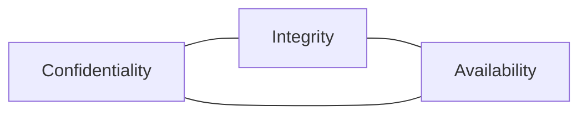
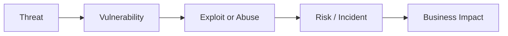
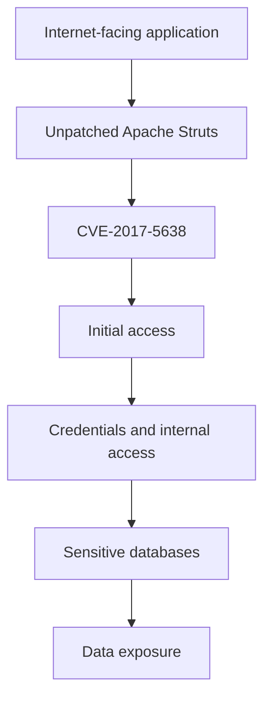

# Task 1 Diagrams

These diagrams are intentionally simple and original. They are meant to explain the security logic rather than decorate the repository.

## CIA Triad

## Risk Chain

## Equifax Attack Chain

